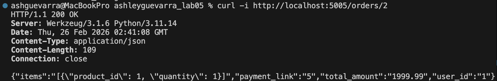
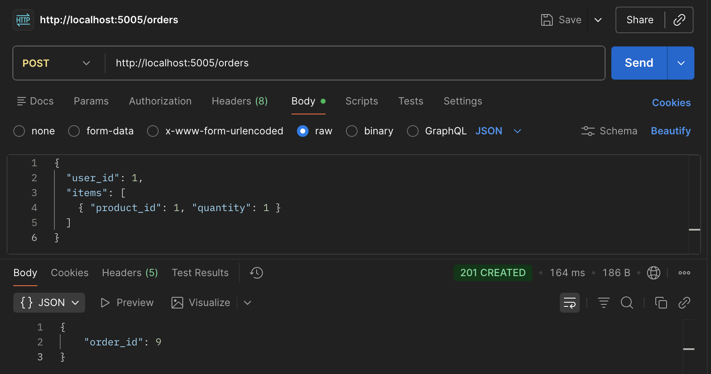
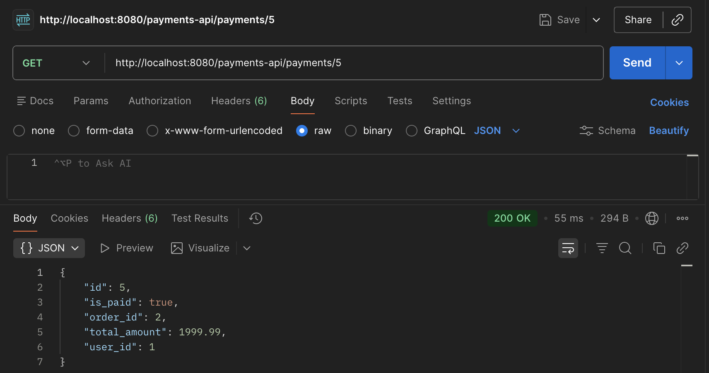
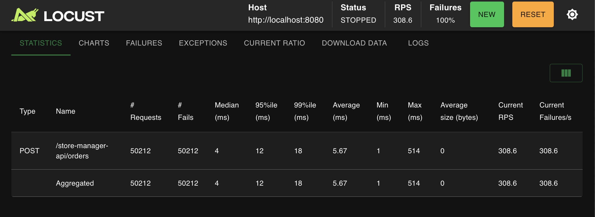
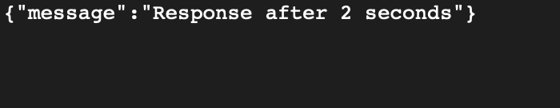
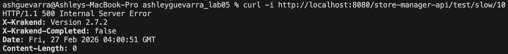
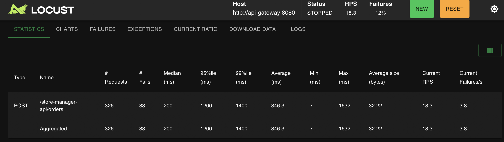

<div align="center">

<h3 style="text-align:center; font-size:14pt;">
ÉCOLE DE TECHNOLOGIE SUPÉRIEURE<br>
UNIVERSITÉ DU QUÉBEC
</h3>

<br><br>

<h3 style="text-align:center; font-size:15pt;">
RAPPORT DE LABORATOIRE <br> 
PRÉSENTÉ À <br> 
M. FABIO PETRILLO <br> 
DANS LE CADRE DU COURS <br>
<em>ARCHITECTURE LOGICIELLE</em> (LOG430-01)
</h3>

<br><br>

<h3 style="text-align:center; font-size:15pt;">
Laboratoire 5 - Microservices, SOA, SBA, API Gateway, Rate Limit & Timeout

</h3>

<br><br>

<h3 style="text-align:center; font-size:15pt;">
PAR
<br>
Ashley Lester Ian GUEVARRA, GUEA70370101
</h3>

<br><br>

<h3 style="text-align:center; font-size:15pt;">
MONTRÉAL, LE 26 FÉVRIER 2026
</h3>

<br><br>

</div>

<div style="page-break-before: always;"></div>

### Tables des matières 
- [Question 1](#question-1)
- [Question 2](#question-2)
- [Question 3](#question-3)
- [Question 4](#question-4)
- [Question 5](#question-5)
- [Question 6](#question-6)
- [Question 7](#question-7)

<div style="page-break-before: always;"></div>

<div style="text-align: justify;">

#### Question 1

> Quelle réponse obtenons-nous à la requête à POST /payments ? Illustrez votre réponse avec des captures d'écran/du terminal.

Pour tester l’intégration avec le microservice de paiement via KrakenD, j’ai exécuté une requête POST vers l’endpoint `/payments-api/payments` à travers l’API Gateway.

La capture d’écran ci-dessous montre la réponse obtenue.

<p style="text-align: center;">
  
  <br>
  <em>Figure 1 – Réponse retournée par KrakenD lors du POST /payments</em>
</p>

La requête retourne un code **HTTP 200 OK** ainsi qu’un objet JSON contenant un champ `payment_id`. Cela signifie que le microservice de paiement a bien créé une transaction et généré un identifiant unique pour celle-ci. Cet identifiant (`payment_id`) est ensuite associé à la commande dans l’application Store Manager afin de permettre le traitement ultérieur du paiement.

</div>

<br>

<div style="page-break-before: always;"></div>

<div style="text-align: justify;">

##### Question 2

> Quel type d'information envoyons-nous dans la requête à POST payments/process/:id ? Est-ce que ce serait le même format si on communiquait avec un service SOA, par exemple ? Illustrez votre réponse avec des exemples et captures d'écran/terminal.

Dans la requête `POST /payments-api/payments/process/{payment_id}`, j’envoie des informations de paiement au format **JSON** dans le body de la requête HTTP.

Plus précisément, les données envoyées sont des informations de carte de crédit :

```json
{
  "cardNumber": 9999999999999,
  "cardCode": 123,
  "expirationDate": "2030-01-05"
}
```

Il s’agit donc d’un message structuré en **JSON**, transporté via le protocole HTTP (architecture REST).  
Le `payment_id` est passé dans l’URL, et les données sensibles sont envoyées dans le body.

Ce format ne serait pas nécessairement le même dans une architecture **SOA classique (ex: SOAP)**.  
Dans un service SOAP, les données seraient généralement encapsulées dans un message **XML**, avec une structure plus formelle définie par un WSDL.

Exemple simplifié d’un équivalent SOAP :

```xml
<soap:Envelope>
  <soap:Body>
    <ProcessPayment>
      <paymentId>5</paymentId>
      <cardNumber>9999999999999</cardNumber>
      <cardCode>123</cardCode>
      <expirationDate>2030-01-05</expirationDate>
    </ProcessPayment>
  </soap:Body>
</soap:Envelope>
```

Donc :

- REST → JSON léger, simple, directement dans le body HTTP  
- SOA/SOAP → XML structuré, enveloppe SOAP obligatoire  

Dans ce laboratoire, on utilise une architecture microservices REST avec JSON.

<p style="text-align: center;">
  
  <br>
  <em>Figure 2 – Requête POST /payments/process/{id} dans Postman</em>
</p>

</div>

<br>

<div style="page-break-before: always;"></div>

<div style="text-align: justify;">

##### Question 3

> Quel résultat obtenons-nous de la requête à POST payments/process/:id?

Lorsque j’exécute la requête :

```
POST http://localhost:8080/payments-api/payments/process/5
```

avec les informations de carte dans le body, le service retourne la réponse suivante :

```json
{
  "is_paid": true,
  "order_id": 2,
  "payment_id": 5
}
```

Cela signifie que :

- Le paiement a été traité avec succès (`is_paid: true`)
- La commande associée est la commande `order_id = 2`
- Le paiement traité correspond au `payment_id = 5`

Ensuite, lorsque je vérifie l’état du paiement avec :

```
GET http://localhost:8080/payments-api/payments/5
```

j’obtiens :

```json
{
  "id": 5,
  "is_paid": true,
  "order_id": 2,
  "total_amount": 1999.99,
  "user_id": 1
}
```

On confirme donc que :

- Le paiement est bien enregistré
- Il est marqué comme payé
- Il est lié à la bonne commande
- Le montant total correspond à celui de la commande

<p style="text-align: center;">
  
  <br>
  <em>Figure 3 – Vérification du paiement avec GET /payments/{id}</em>
</p>

</div>

<br>

<div style="page-break-before: always;"></div>

<div style="text-align: justify;">

##### Question 4

> Quelle méthode avez-vous dû modifier dans log430-labo05-payment et qu'avez-vous modifiée ? Justifiez avec un extrait de code.

Pour cette étape, j’ai modifié la méthode `process_payment(payment_id, credit_card_data)` 
dans le fichier :

```
src/controllers/payment_controller.py
```

Cette méthode est appelée lorsque l’endpoint suivant est exécuté :

```
POST /payments/process/{payment_id}
```

---

#### Modification effectuée

Dans la version initiale du code, après la mise à jour du statut du paiement, 
un appel placeholder était présent :

```python
# TODO: appelez la méthode correctement
update_order(0, False)
```

Cet appel n’utilisait pas les valeurs réelles retournées par la mise à jour du paiement 
et ne permettait donc pas de notifier correctement le service **store_manager**.

J’ai remplacé cet appel par :

```python
update_order(update_result["order_id"], update_result["is_paid"])
```

Ce changement permet d’utiliser :

- Le véritable `order_id` associé au paiement
- La valeur réelle de `is_paid`

---

#### Implémentation de la méthode update_order

J’ai ensuite implémenté la méthode `update_order(order_id, is_paid)` 
afin d’effectuer un appel HTTP `PUT` via KrakenD vers l’endpoint défini dans `config/krakend.json` :

```python
def update_order(order_id, is_paid):
    payload = {
        "order_id": order_id,
        "is_paid": is_paid
    }

    requests.put(
        "http://api-gateway:8080/store-manager-api/orders",
        json=payload,
        timeout=5
    ).raise_for_status()
```

---

#### Explication architecturale

Après le traitement réussi du paiement :

1. Le microservice *payment* met à jour son propre statut (`is_paid = true`).
2. Il appelle ensuite l’API Gateway (KrakenD).
3. KrakenD redirige la requête vers le microservice *store_manager*.
4. La commande correspondante est mise à jour avec `is_paid = true`.

Cette modification permet de propager l’état du paiement au service de gestion des commandes,
plutôt que de conserver cette information uniquement dans le microservice de paiement.

Elle respecte l’architecture microservices en passant obligatoirement par l’API Gateway
telle que configurée dans `krakend.json`.

</div>

<br>

<div style="page-break-before: always;"></div>

<div style="text-align: justify;">

##### Question 5

> À partir de combien de requêtes par minute observez-vous les erreurs 503 ? Justifiez avec des captures d'écran de Locust.

Pour tester le mécanisme de **rate limiting**, j’ai exécuté Locust avec les paramètres suivants :

- Number of users : 100  
- Spawn rate : 1  
- Host : http://localhost:8080  

Dans le fichier `krakend.json`, le rate limiting est configuré comme suit :

```json
"qos/ratelimit/router": {
  "max_rate": 200,
  "every": "1m"
}
```

Cela signifie que l’endpoint accepte un maximum de **200 requêtes par minute**.

Lors du test, Locust a généré environ :

- **308,6 requêtes par seconde (RPS)**

Ce qui correspond à :

```
308,6 × 60 ≈ 18 516 requêtes par minute
```

À ce moment, toutes les requêtes ont commencé à retourner des erreurs :

```
HTTP 503 – Service Unavailable
```

Les erreurs 503 apparaissent donc dès que le nombre de requêtes dépasse la limite configurée de **200 requêtes par minute**.

En pratique, la limite correspond à environ :

```
200 ÷ 60 ≈ 3,33 requêtes par seconde
```

Toute valeur supérieure à environ **3 requêtes par seconde** déclenche le mécanisme de rate limiting.

La capture d’écran ci-dessous montre :

- 50 212 requêtes envoyées  
- 50 212 échecs  
- 100 % de failures  
- 308,6 RPS  

<p style="text-align: center;">
  
  <br>
  <em>Figure 4 – Apparition des erreurs 503 après dépassement du seuil de 200 requêtes par minute</em>
</p>

Ces résultats confirment que le mécanisme de rate limiting configuré dans KrakenD fonctionne correctement et protège l’API contre une surcharge excessive.

</div> 

<br>

<div style="page-break-before: always;"></div>

<div style="text-align: justify;">

##### Question 6

> Que se passe-t-il dans le navigateur quand vous faites une requête avec un délai supérieur au timeout configuré (5 secondes) ? Quelle est l'importance du timeout dans une architecture de microservices ? Justifiez votre réponse avec des exemples pratiques.

Pour tester le mécanisme de timeout, j’ai ajouté un endpoint dans `store_manager.py` qui simule une réponse lente à l’aide de `time.sleep(delay_seconds)`.

Lorsque j’appelle l’URL suivante :

```
http://localhost:8080/store-manager-api/test/slow/2
```

la réponse est retournée normalement :

```json
{ "message": "Response after 2 seconds" }
```

<p style="text-align: center;">
  
  <br>
  <em>Figure 5 – Réponse normale pour un délai inférieur au timeout (2 secondes)</em>
</p>

---

En revanche, lorsque j’exécute :

```
http://localhost:8080/store-manager-api/test/slow/10
```

la requête dépasse le timeout configuré à **5 secondes** dans `krakend.json`.  
KrakenD interrompt alors l’appel vers le backend avant que celui-ci ne termine.

La vérification avec `curl -i` montre :

```
HTTP/1.1 500 Internal Server Error
X-Krakend: Version 2.7.2
X-Krakend-Completed: false
Content-Length: 0
```

<p style="text-align: center;">
  
  <br>
  <em>Figure 6 – Timeout via KrakenD : erreur HTTP 500 lorsque le délai dépasse 5 secondes</em>
</p>

---

#### Importance du timeout dans une architecture microservices

Le timeout est essentiel dans une architecture microservices, car une requête peut dépendre de plusieurs services interconnectés.  
Sans timeout, un service lent pourrait bloquer indéfiniment les appels en amont et provoquer un effet domino (cascading failure).

Les conséquences possibles sans timeout seraient :

- Saturation des connexions HTTP
- Threads bloqués dans l’API Gateway
- Augmentation globale de la latence
- Dégradation complète du système

Dans notre cas, KrakenD coupe la requête après 5 secondes, ce qui :

- Protège l’API Gateway
- Empêche l’accumulation de requêtes en attente
- Limite la propagation d’un problème à l’ensemble du système

Le timeout est donc un mécanisme fondamental de résilience dans une architecture distribuée.

</div> 

<br>

<div style="page-break-before: always;"></div>

<div style="text-align: justify;">

##### Question 7

> Exécutez un test de charge sur l'application Store Manager et notez vos observations sur les performances.

Un test de charge a été exécuté à l’aide de Locust en ciblant l’API Gateway (KrakenD) avec l’endpoint :

POST /store-manager-api/orders

Configuration utilisée :
- 50 utilisateurs
- Spawn rate : 2 utilisateurs par seconde
- Host : http://api-gateway:8080

Résultats observés :

- RPS (requêtes par seconde) : ~18.3
- Total de requêtes : 326
- Taux d’échec : 12 %
- Temps de réponse médian : 200 ms
- Temps de réponse moyen : 346 ms
- 95e percentile : 1200 ms
- 99e percentile : 1400 ms
- Temps maximum observé : 1532 ms

Ces résultats montrent que le système est capable de supporter environ 1000 requêtes par minute dans un environnement local Docker. Cependant, sous charge, on observe une augmentation significative de la latence ainsi qu’un certain nombre d’échecs (12 %).

Les échecs peuvent être causés par :
- La saturation des ressources (CPU, mémoire)
- La base de données MySQL sous forte charge
- Des limites internes de connexion ou de threads
- Des délais réseau entre microservices

On observe également que les percentiles élevés (95% et 99%) augmentent fortement, ce qui indique que certaines requêtes deviennent beaucoup plus lentes sous pression.

Ce comportement est typique d’une architecture microservices lorsque plusieurs composants (API Gateway, Store Manager, base de données) doivent collaborer pour traiter chaque requête.

<p style="text-align: center;">
  
  <br>
  <em>Figure 7 – Résultats du test de charge avec Locust</em>
</p>

</div>

</div> 

<br>